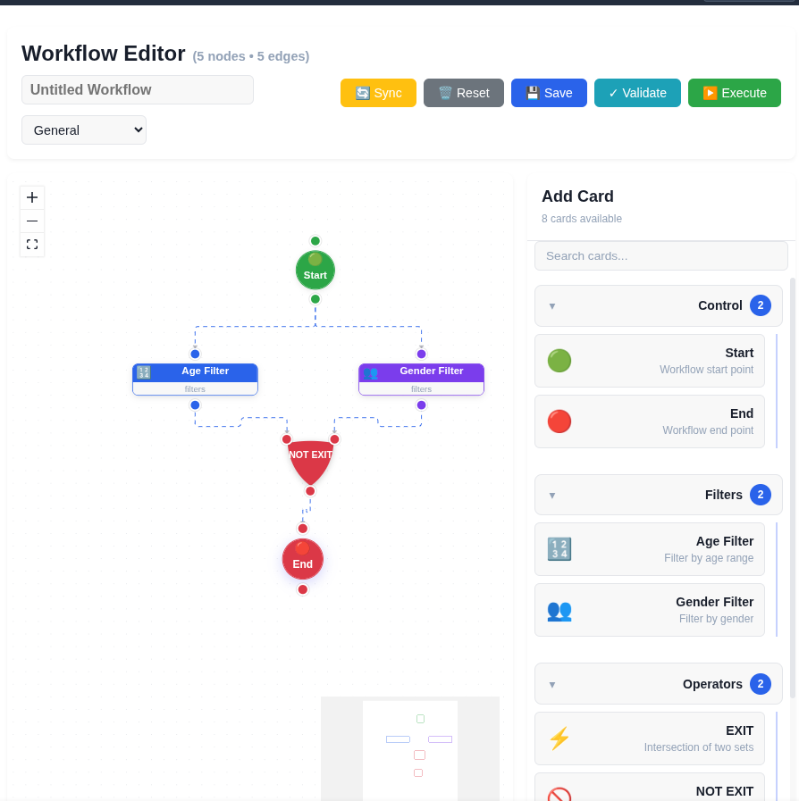

# easyworkflow

> A fully configurable, i18n-ready visual workflow editor for React — drag-and-drop nodes, custom editors, adapter-based backend, MIT licensed.

[](https://www.npmjs.com/package/@malevin/easyworkflow)
[](https://opensource.org/licenses/MIT)
[](https://www.typescriptlang.org/)

## Demo



_Screenshot placeholder — replace with an animated GIF or embed a live demo link when available._

Try the bundled example:

```bash
cd examples/basic
npm install
npm run dev
```

## Key features

- **Visual editor** — React Flow canvas with snap-to-grid, minimap, and controls
- **Drag-and-drop palette** — searchable hierarchical categories built from card definitions
- **Custom node editors** — register per-node-type editors via `nodeEditorRegistry`
- **Schema-driven forms** — auto-generate parameter forms from JSON Schema `parameters_schema`
- **Adapter pattern** — plug any backend through `APIAdapter` (`getCards`, `saveWorkflow`, `loadWorkflow`, …)
- **i18n + RTL** — locale-keyed card labels; automatic RTL for `ar`, `fa`, `he`, `ur`, and more
- **Configurable toolbar** — pass your own `actions` or extend defaults with `toolbarActions`
- **Theming** — CSS variables and dark mode via `[data-theme="dark"]`
- **Keyboard shortcuts** — copy (Ctrl+C), paste (Ctrl+V), duplicate (Ctrl+D), delete, Escape
- **MIT licensed** — no vendor lock-in

## Quick start

### Installation

```bash
npm install @malevin/easyworkflow @xyflow/react
```

`@xyflow/react` is a peer dependency and must be installed separately.

### Minimal working example

```tsx
import { WorkflowEditor, EasyFlowI18nProvider, emptyAdapter } from '@malevin/easyworkflow';
import type { APIAdapter, CardDefinition } from '@malevin/easyworkflow';
import '@malevin/easyworkflow/styles';

const cards: CardDefinition[] = [
  {
    id: 1,
    card_key: 'start',
    node_type: 'control.start',
    display_name: 'Start',
    display_name_i18n: { en: 'Start', fa: 'شروع' },
    icon: '🟢',
    category: 'control',
    ui_config: { shape: 'ellipse', color: '#10b981', size: 'small' },
  },
];

const adapter: APIAdapter = {
  getCards: () => Promise.resolve(cards),
  saveWorkflow: (wf) => Promise.resolve({ id: 'local', ...wf }),
};

export default function App() {
  return (
    <EasyFlowI18nProvider locale="en">
      <div style={{ height: '100vh' }}>
        <WorkflowEditor adapter={adapter} />
      </div>
    </EasyFlowI18nProvider>
  );
}
```

You now have a working editor with a drag-and-drop canvas, searchable palette, built-in node editor, Save/Reset toolbar, and optional RTL.

## Advanced examples

### Custom adapter (backend integration)

The adapter is the single source of truth for cards and persistence:

```tsx
import type { APIAdapter, CardDefinition } from '@malevin/easyworkflow';

const myCards: CardDefinition[] = [
  {
    id: 1,
    card_key: 'control.start',
    node_type: 'control.start',
    display_name: 'Start',
    display_name_i18n: { en: 'Start', fa: 'شروع', ar: 'بدء' },
    icon: '🟢',
    category: 'control',
    ui_config: { shape: 'ellipse', color: '#10b981', size: 'small' },
  },
];

const myAdapter: APIAdapter = {
  // REQUIRED — cards appear in the palette
  getCards: () => Promise.resolve(myCards),

  // Optional
  syncCards: () => Promise.resolve({ created: 0, updated: 0, total: myCards.length }),

  loadWorkflow: (id) => fetch(`/api/workflows/${id}`).then((r) => r.json()),

  saveWorkflow: (wf) =>
    fetch('/api/workflows', {
      method: 'POST',
      headers: { 'Content-Type': 'application/json' },
      body: JSON.stringify(wf),
    }).then((r) => r.json()),

  validateWorkflow: (id) =>
    fetch(`/api/workflows/${id}/validate`, { method: 'POST' }).then((r) => r.json()),

  executeWorkflow: (id) =>
    fetch(`/api/workflows/${id}/execute`, { method: 'POST' }).then(() => undefined),

  getWorkflowStatus: (id) => fetch(`/api/workflows/${id}/status`).then((r) => r.json()),
};

export function Editor() {
  return (
    <WorkflowEditor
      adapter={myAdapter}
      onSave={(wf) => console.log('Saved payload:', wf)}
      onExecute={(id) => console.log('Execute:', id)}
      onValidate={(id) => console.log('Validate:', id)}
    />
  );
}
```

For demos or tests without a backend, use the bundled `emptyAdapter`.

### Events and toolbar actions

By default the editor renders Save + Reset. Pass `actions` to fully control the toolbar:

```tsx
import { WorkflowEditor } from '@malevin/easyworkflow';

<WorkflowEditor
  adapter={myAdapter}
  actions={[
    {
      key: 'save',
      label: 'Save Draft',
      icon: '💾',
      variant: 'primary',
      onClick: async (ctx) => {
        // ctx: { workflowId, name, type, nodes, edges, adapter }
        console.log('Saving', ctx.nodes.length, 'nodes');
      },
    },
    {
      key: 'publish',
      label: 'Publish',
      icon: '🚀',
      variant: 'success',
      onClick: async (ctx) => {
        await api.publish(ctx);
      },
      disabled: !isValid,
      visible: hasPermission,
    },
  ]}
/>;
```

Append extra buttons without replacing defaults via `toolbarActions`:

```tsx
<WorkflowEditor
  adapter={myAdapter}
  toolbarActions={[
    {
      key: 'export',
      label: 'Export JSON',
      icon: '📤',
      variant: 'secondary',
      onClick: () => downloadJSON(),
    },
  ]}
/>
```

### Custom node editors

```tsx
import { nodeEditorRegistry } from '@malevin/easyworkflow';
import { MyFilterEditor } from './MyFilterEditor';

nodeEditorRegistry.register(
  'my-filter-editor',
  (nodeType) => nodeType.startsWith('filter.'),
  MyFilterEditor
);
```

The editor component receives `{ node, onUpdate, onDelete, onCancel, variableSuggestions }`.

### Internationalization

```tsx
display_name_i18n: {
  en: 'Gender Filter',
  fa: 'فیلتر جنسیت',
  ar: 'فلتر الجنس',
}

<EasyFlowI18nProvider locale="ar">
```

RTL is applied automatically for Arabic, Persian, Hebrew, Urdu, and others.

### Theming

```css
:root {
  --ef-primary: #6366f1;
  --ef-bg: #ffffff;
  --ef-text-color: #0f172a;
  --ef-border-color: #e2e8f0;
}

[data-theme='dark'] {
  --ef-bg: #0b1120;
  --ef-card-bg: #111827;
  --ef-text-color: #f1f5f9;
}
```

Full variable reference: `src/styles/easyflow.css`.

## API reference

### Components

| Export                 | Description                                              |
| ---------------------- | -------------------------------------------------------- |
| `WorkflowEditor`       | Main editor (canvas + palette + node editor)             |
| `Canvas`               | React Flow wrapper                                       |
| `FlowNode`             | Node component (rect / ellipse / diamond / downtriangle) |
| `Palette`              | Hierarchical card palette                                |
| `NodeEditorPanel`      | Side panel (palette / node editor / edge info)           |
| `BaseNodeEditor`       | Default form-based node editor                           |
| `SchemaDrivenEditor`   | Auto-forms from JSON Schema                              |
| `Toolbar`              | Standalone toolbar                                       |
| `EasyFlowI18nProvider` | i18n context provider                                    |

### Hooks

| Export           | Description                                 |
| ---------------- | ------------------------------------------- |
| `useWorkflow`    | State management for nodes, edges, metadata |
| `useTranslation` | i18n hook returning `{ t, locale, isRTL }`  |

### Registries

| Export               | Description                          |
| -------------------- | ------------------------------------ |
| `nodeEditorRegistry` | Register custom editors by node type |
| `nodeShapeRegistry`  | Register custom node shapes          |

### Utilities

| Export                              | Description                    |
| ----------------------------------- | ------------------------------ |
| `generateNodeId` / `generateEdgeId` | Unique ID generators           |
| `buildCategoryTree`                 | Build hierarchy from cards     |
| `normalizeCategoryKey`              | Lowercase + trim category keys |
| `humanizeCategoryLabel`             | Title-case a category key      |
| `pickLocalized`                     | Pick value from an `_i18n` map |
| `isRTLLocale`                       | RTL detection for any locale   |

### Adapters

| Export         | Description                        |
| -------------- | ---------------------------------- |
| `emptyAdapter` | Empty adapter for demos and tests  |
| `noopAdapter`  | Deprecated alias of `emptyAdapter` |

## Credits

Built on top of:

- [@xyflow/react](https://github.com/xyflow/xyflow) — MIT License
- [React](https://react.dev) — MIT License

All dependencies are MIT licensed. This package is compatible with commercial use.

## Contributing

Contributions are welcome. See [CONTRIBUTING.md](./CONTRIBUTING.md) for setup, testing, and pull-request guidelines.

## License

MIT © Mohsen Akbari. See [LICENSE](./LICENSE) for details.
